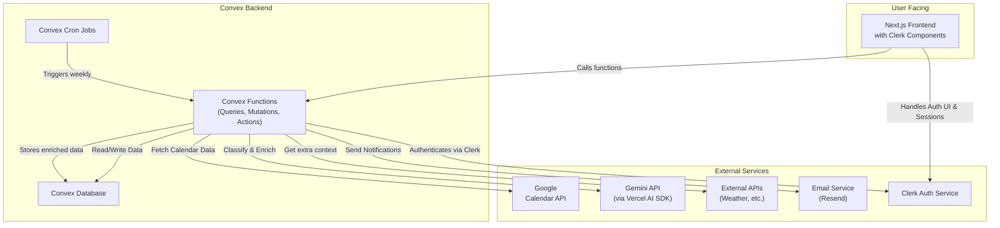

# Smart Calendar AI Agent

This project is a smart AI calendar agent that scans your calendar, classifies events, enriches them with relevant context, and sends proactive notifications.

## 🚀 Core Features

- **Weekly Calendar Scans**: Automatically connects to your Google Calendar and scans for upcoming events.
- **AI-Powered Classification**: Uses AI to categorize events into types like flights, reservations, personal appointments, etc.
- **Contextual Enrichment**: Enriches events with useful information (e.g., flight terminal info, weather at destination, restaurant ratings).
- **Proactive Notifications**: Sends email summaries and to-dos based on the enriched event data.

## 🛠️ Tech Stack & Architecture

This project is built on a modern, serverless, and real-time stack:

- **Frontend**: [Next.js](https://nextjs.org/) (hosted on Vercel)
- **Authentication**: [Clerk](https://clerk.com/) for user management and secure OAuth token handling.
- **Backend & Database**: [Convex](https://www.convex.dev/) for the backend logic (queries, mutations, actions) and real-time database.
- **AI**: [Google Gemini](https://ai.google.dev/) via the [Vercel AI SDK](https://sdk.vercel.ai/) for classification and enrichment.
- **Email**: [Resend](https://resend.com/) for sending email notifications.

### Architectural Flow

---

## 🗺️ Development Plan & Roadmap

This project will be built in phases to ensure a solid foundation and iterative progress.

### Phase 1: Core Connectivity & Manual Trigger

_Goal: Establish a complete, working loop from user authentication to fetching their calendar data and displaying it._

- [ ] **Setup: Project Initialization**
  - [x] Initialize Next.js, Clerk, and Convex.
  - [x] Install all necessary dependencies (`convex`, `@clerk/nextjs`, `ai`).
- [ ] **Schema Definition**
  - [ ] Define `users`, `processedEvents`, and `notifications` tables in `convex/schema.ts`.
- [ ] **Authentication & Calendar Connection**
  - [ ] Configure Clerk to handle Google OAuth, requesting `calendar.readonly` scope.
  - [ ] Implement the UI flow for a user to connect their Google Calendar.
  - [ ] Set up a Clerk webhook to notify Convex when a new user signs up or connects their calendar.
- [ ] **Data Fetching Logic**
  - [ ] Create a Convex action that can use a stored Google token from Clerk to fetch calendar events.
- [ ] **Frontend UI**
  - [ ] Build a simple, protected page (`/dashboard`).
  - [ ] Add a button on the dashboard to manually trigger the calendar scan for the logged-in user.
  - [ ] Display the raw, fetched calendar data on the page.

### Phase 2: AI Enrichment & Notifications

_Goal: Integrate the "smart" features, including AI classification, enrichment, and email notifications._

- [ ] **AI Classification**
  - [ ] Create a Convex action that takes an event and uses Gemini to classify its type (`Flight`, `Restaurant`, etc.).
- [ ] **AI Enrichment**
  - [ ] Create a Convex action that uses Gemini's function-calling capabilities to enrich the event data based on its type.
  - [ ] Store the enriched data in the `notifications` table in Convex.
- [ ] **Email Integration**
  - [ ] Integrate Resend and create a Convex action to send a formatted email containing the enriched notification.
  - [ ] Build a basic email template (e.g., using React Email).

### Phase 3: Automation & Polish

_Goal: Move from a manual system to a fully automated agent and refine the user experience._

- [ ] **Automation**
  - [ ] Implement a weekly cron job in `convex/crons.ts` to run the entire pipeline automatically for all users.
  - [ ] Disable or hide the manual trigger button on the frontend.
- [ ] **UI/UX Refinements**
  - [ ] Create a polished UI to display the history of sent notifications.
  - [ ] Add user settings (e.g., notification preferences).
- [ ] **Production Readiness**
  - [ ] Set up production environments for Clerk, Convex, and Vercel.
  - [ ] Add comprehensive error handling and logging.

---

This README will be updated as the project progresses.
